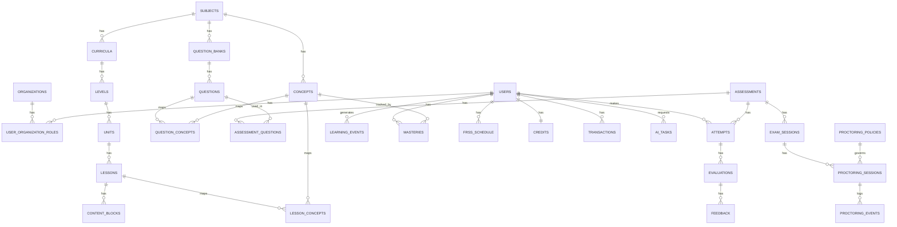

# ALR Domain Model — ERD Final v1
Rujukan: ADR-0001. File ini adalah representasi teknis (SQL) dari ADR-0001, dipakai langsung sebagai dasar migration P0-007.



## Migration SQL (PostgreSQL) — siap dipakai P0-007

```sql
-- === Identity & Organization ===
CREATE TABLE organizations (
    id UUID PRIMARY KEY DEFAULT gen_random_uuid(),
    name TEXT NOT NULL,
    slug TEXT UNIQUE NOT NULL,
    type TEXT NOT NULL CHECK (type IN ('platform','school','tutor_org')),
    settings JSONB NOT NULL DEFAULT '{}',
    created_at TIMESTAMPTZ NOT NULL DEFAULT now()
);

CREATE TABLE users (
    id UUID PRIMARY KEY DEFAULT gen_random_uuid(),
    email TEXT UNIQUE NOT NULL,
    google_id TEXT UNIQUE,
    name TEXT NOT NULL,
    avatar_url TEXT,
    locale TEXT NOT NULL DEFAULT 'id',
    created_at TIMESTAMPTZ NOT NULL DEFAULT now()
);

CREATE TABLE user_organization_roles (
    id UUID PRIMARY KEY DEFAULT gen_random_uuid(),
    user_id UUID NOT NULL REFERENCES users(id),
    organization_id UUID NOT NULL REFERENCES organizations(id),
    role TEXT NOT NULL CHECK (role IN (
        'platform_admin','org_owner','academic_director','curriculum_developer',
        'reviewer','teacher','tutor','student','parent')),
    created_at TIMESTAMPTZ NOT NULL DEFAULT now(),
    UNIQUE(user_id, organization_id, role)
);

-- === Curriculum Tree ===
CREATE TABLE subjects (
    id UUID PRIMARY KEY DEFAULT gen_random_uuid(),
    code TEXT UNIQUE NOT NULL,
    name TEXT NOT NULL
);

CREATE TABLE curricula (
    id UUID PRIMARY KEY DEFAULT gen_random_uuid(),
    subject_id UUID NOT NULL REFERENCES subjects(id),
    code TEXT UNIQUE NOT NULL,
    name TEXT NOT NULL,
    framework TEXT NOT NULL CHECK (framework IN ('cefr','cambridge','kurikulum_id','custom')),
    version INT NOT NULL DEFAULT 1,
    status TEXT NOT NULL DEFAULT 'draft' CHECK (status IN ('draft','published','archived'))
);

CREATE TABLE levels (
    id UUID PRIMARY KEY DEFAULT gen_random_uuid(),
    curriculum_id UUID NOT NULL REFERENCES curricula(id),
    code TEXT NOT NULL,
    name TEXT NOT NULL,
    order_index INT NOT NULL
);

CREATE TABLE units (
    id UUID PRIMARY KEY DEFAULT gen_random_uuid(),
    level_id UUID NOT NULL REFERENCES levels(id),
    code TEXT NOT NULL,
    title TEXT NOT NULL,
    order_index INT NOT NULL
);

CREATE TABLE lessons (
    id UUID PRIMARY KEY DEFAULT gen_random_uuid(),
    unit_id UUID NOT NULL REFERENCES units(id),
    title TEXT NOT NULL,
    type TEXT NOT NULL CHECK (type IN ('learn','practice','speaking','writing','review','assessment')),
    order_index INT NOT NULL,
    status TEXT NOT NULL DEFAULT 'draft' CHECK (status IN ('draft','in_review','published','archived')),
    version INT NOT NULL DEFAULT 1,
    superseded_by UUID REFERENCES lessons(id),  -- ADR-0008, added migration 0012
    qa_report JSONB  -- P2-014, added migration 0015
);

CREATE TABLE content_blocks (
    id UUID PRIMARY KEY DEFAULT gen_random_uuid(),
    lesson_id UUID NOT NULL REFERENCES lessons(id),
    type TEXT NOT NULL,
    order_index INT NOT NULL,
    data JSONB NOT NULL DEFAULT '{}',
    raw_source TEXT
);

-- === Concept Graph ===
CREATE TABLE concepts (
    id UUID PRIMARY KEY DEFAULT gen_random_uuid(),
    subject_id UUID NOT NULL REFERENCES subjects(id),
    code TEXT NOT NULL,
    name TEXT NOT NULL,
    type TEXT NOT NULL CHECK (type IN ('grammar','vocabulary','skill','pronunciation')),
    parent_concept_id UUID REFERENCES concepts(id),  -- ADR-0007, added migration 0011; containment hierarchy, distinct from concept_prerequisites below
    indonesian_difficulty_tag TEXT,  -- P2-012, added migration 0014; free-form for now
    UNIQUE(subject_id, code)
);

CREATE TABLE lesson_concepts (
    lesson_id UUID NOT NULL REFERENCES lessons(id),
    concept_id UUID NOT NULL REFERENCES concepts(id),
    weight FLOAT NOT NULL DEFAULT 1.0,
    PRIMARY KEY (lesson_id, concept_id)
);

CREATE TABLE concept_prerequisites (
    concept_id UUID NOT NULL REFERENCES concepts(id),
    prerequisite_concept_id UUID NOT NULL REFERENCES concepts(id),
    PRIMARY KEY (concept_id, prerequisite_concept_id)
);

-- === Question Bank ===
CREATE TABLE question_banks (
    id UUID PRIMARY KEY DEFAULT gen_random_uuid(),
    subject_id UUID NOT NULL REFERENCES subjects(id),
    name TEXT NOT NULL
);

CREATE TABLE questions (
    id UUID PRIMARY KEY DEFAULT gen_random_uuid(),
    bank_id UUID NOT NULL REFERENCES question_banks(id),
    type TEXT NOT NULL,
    difficulty FLOAT NOT NULL DEFAULT 0.5 CHECK (difficulty >= 0 AND difficulty <= 1),
    data JSONB NOT NULL,
    correct_answer JSONB NOT NULL,
    explanation JSONB,
    status TEXT NOT NULL DEFAULT 'draft' CHECK (status IN ('draft','in_review','published','archived')),
    version INT NOT NULL DEFAULT 1,
    superseded_by UUID REFERENCES questions(id),  -- ADR-0008, added migration 0012
    qa_report JSONB,  -- P2-014, added migration 0015
    cefr_tag TEXT CHECK (cefr_tag IN ('a1','a2','b1','b2','c1','c2'))  -- P2-014, added migration 0015
);

CREATE TABLE question_concepts (
    question_id UUID NOT NULL REFERENCES questions(id),
    concept_id UUID NOT NULL REFERENCES concepts(id),
    PRIMARY KEY (question_id, concept_id)
);

-- === Assessment & Attempt ===
CREATE TABLE assessments (
    id UUID PRIMARY KEY DEFAULT gen_random_uuid(),
    type TEXT NOT NULL CHECK (type IN ('unit_test','level_assessment','mock_exam','ielts','toefl','pte')),
    title TEXT NOT NULL,
    config JSONB NOT NULL DEFAULT '{}'
);

CREATE TABLE assessment_questions (
    assessment_id UUID NOT NULL REFERENCES assessments(id),
    question_id UUID NOT NULL REFERENCES questions(id),
    order_index INT NOT NULL,
    points FLOAT NOT NULL DEFAULT 1.0,
    PRIMARY KEY (assessment_id, question_id)
);

CREATE TABLE attempts (
    id UUID PRIMARY KEY DEFAULT gen_random_uuid(),
    user_id UUID NOT NULL REFERENCES users(id),
    assessment_id UUID REFERENCES assessments(id),
    lesson_id UUID REFERENCES lessons(id),
    started_at TIMESTAMPTZ NOT NULL DEFAULT now(),
    submitted_at TIMESTAMPTZ,
    answers JSONB NOT NULL DEFAULT '{}',
    score FLOAT,
    status TEXT NOT NULL DEFAULT 'in_progress' CHECK (status IN ('in_progress','submitted','evaluated')),
    question_snapshot JSONB,  -- ADR-0008, added migration 0012; question content as of submit time
    CHECK (assessment_id IS NOT NULL OR lesson_id IS NOT NULL)
);
CREATE INDEX idx_attempts_user ON attempts(user_id);

-- === Evaluation & Feedback ===
CREATE TABLE rubrics (
    id UUID PRIMARY KEY DEFAULT gen_random_uuid(),
    name TEXT NOT NULL,
    criteria JSONB NOT NULL
);

CREATE TABLE evaluations (
    id UUID PRIMARY KEY DEFAULT gen_random_uuid(),
    attempt_id UUID NOT NULL REFERENCES attempts(id),
    evaluator_type TEXT NOT NULL CHECK (evaluator_type IN ('ai','human')),
    rubric_id UUID REFERENCES rubrics(id),
    scores JSONB NOT NULL DEFAULT '{}',
    evidence JSONB,
    created_at TIMESTAMPTZ NOT NULL DEFAULT now()
);

CREATE TABLE feedback (
    id UUID PRIMARY KEY DEFAULT gen_random_uuid(),
    evaluation_id UUID NOT NULL REFERENCES evaluations(id),
    type TEXT NOT NULL CHECK (type IN ('annotation','comment','voice_note')),
    content TEXT NOT NULL,
    position JSONB,
    created_by UUID REFERENCES users(id)
);

-- === Learning Engine ===
CREATE TABLE learning_events (
    id UUID PRIMARY KEY DEFAULT gen_random_uuid(),
    user_id UUID NOT NULL REFERENCES users(id),
    event_type TEXT NOT NULL,
    entity_type TEXT NOT NULL,
    entity_id UUID NOT NULL,
    payload JSONB NOT NULL DEFAULT '{}',
    created_at TIMESTAMPTZ NOT NULL DEFAULT now()
);
CREATE INDEX idx_learning_events_user_time ON learning_events(user_id, created_at);
CREATE INDEX idx_learning_events_entity ON learning_events(entity_type, entity_id);

CREATE TABLE masteries (
    id UUID PRIMARY KEY DEFAULT gen_random_uuid(),
    user_id UUID NOT NULL REFERENCES users(id),
    concept_id UUID NOT NULL REFERENCES concepts(id),
    score FLOAT NOT NULL DEFAULT 0,
    confidence FLOAT NOT NULL DEFAULT 0,
    last_reviewed_at TIMESTAMPTZ,
    updated_at TIMESTAMPTZ NOT NULL DEFAULT now(),
    UNIQUE(user_id, concept_id)
);

CREATE TABLE frss_schedule (
    id UUID PRIMARY KEY DEFAULT gen_random_uuid(),
    user_id UUID NOT NULL REFERENCES users(id),
    concept_id UUID NOT NULL REFERENCES concepts(id),
    interval_days FLOAT NOT NULL DEFAULT 1.0,
    ease_factor FLOAT NOT NULL DEFAULT 2.5,
    due_at TIMESTAMPTZ NOT NULL DEFAULT now(),
    last_result TEXT CHECK (last_result IN ('recalled','partial','forgot')),
    UNIQUE(user_id, concept_id)
);
CREATE INDEX idx_frss_due ON frss_schedule(user_id, due_at);

-- === Economy ===
CREATE TABLE credits (
    user_id UUID PRIMARY KEY REFERENCES users(id),
    balance BIGINT NOT NULL DEFAULT 0,
    updated_at TIMESTAMPTZ NOT NULL DEFAULT now()
);

CREATE TABLE transactions (
    id UUID PRIMARY KEY DEFAULT gen_random_uuid(),
    user_id UUID NOT NULL REFERENCES users(id),
    type TEXT NOT NULL CHECK (type IN ('earn','spend','purchase','refund','payout_earned','payout_withdrawn')),
    amount BIGINT NOT NULL,
    reference TEXT,
    expires_at TIMESTAMPTZ,
    created_at TIMESTAMPTZ NOT NULL DEFAULT now()
);
CREATE INDEX idx_transactions_user ON transactions(user_id);

CREATE TABLE ai_tasks (
    id UUID PRIMARY KEY DEFAULT gen_random_uuid(),
    user_id UUID REFERENCES users(id),
    task_type TEXT NOT NULL,
    provider TEXT NOT NULL,
    model TEXT NOT NULL,
    prompt_id TEXT NOT NULL,
    tokens_used INT,
    cost NUMERIC,
    status TEXT NOT NULL DEFAULT 'queued' CHECK (status IN ('queued','running','done','failed')),
    created_at TIMESTAMPTZ NOT NULL DEFAULT now()
);

-- === Exam Runtime & Proctoring ===
CREATE TABLE exam_sessions (
    id UUID PRIMARY KEY DEFAULT gen_random_uuid(),
    assessment_id UUID NOT NULL REFERENCES assessments(id),
    user_id UUID NOT NULL REFERENCES users(id),
    status TEXT NOT NULL DEFAULT 'not_started' CHECK (status IN ('not_started','in_progress','submitted','timed_out')),
    started_at TIMESTAMPTZ,
    submitted_at TIMESTAMPTZ
);

CREATE TABLE proctoring_policies (
    id UUID PRIMARY KEY DEFAULT gen_random_uuid(),
    exam_type TEXT NOT NULL,
    camera TEXT NOT NULL DEFAULT 'off' CHECK (camera IN ('off','optional','on')),
    microphone TEXT NOT NULL DEFAULT 'off' CHECK (microphone IN ('off','optional','on')),
    screen TEXT NOT NULL DEFAULT 'off' CHECK (screen IN ('off','optional','on')),
    fullscreen_required BOOLEAN NOT NULL DEFAULT false,
    focus_monitoring BOOLEAN NOT NULL DEFAULT false
);

CREATE TABLE proctoring_sessions (
    id UUID PRIMARY KEY DEFAULT gen_random_uuid(),
    exam_session_id UUID NOT NULL REFERENCES exam_sessions(id),
    policy_id UUID NOT NULL REFERENCES proctoring_policies(id),
    device_info JSONB
);

CREATE TABLE assets (
    id UUID PRIMARY KEY DEFAULT gen_random_uuid(),
    user_id UUID REFERENCES users(id),  -- Drive feature: this is the *owner* for drive_permissions.rs purposes
    url TEXT NOT NULL,  -- re-signed fresh on every read (GET /assets*) — see Drive section below, don't trust this at rest
    type TEXT NOT NULL,
    visibility TEXT NOT NULL DEFAULT 'private' CHECK (visibility IN ('public','private')),  -- P2-010, added migration 0013
    created_at TIMESTAMPTZ NOT NULL DEFAULT now(),
    filename TEXT,  -- Drive feature, migration 0016; NULL for pre-Drive rows
    folder_id UUID REFERENCES folders(id),  -- Drive feature, migration 0017; NULL = root
    updated_at TIMESTAMPTZ NOT NULL DEFAULT now(),  -- Drive feature, migration 0017
    deleted_at TIMESTAMPTZ  -- Drive feature, migration 0017 — trash marker
);

CREATE TABLE proctoring_events (
    id UUID PRIMARY KEY DEFAULT gen_random_uuid(),
    proctoring_session_id UUID NOT NULL REFERENCES proctoring_sessions(id),
    type TEXT NOT NULL,
    severity TEXT NOT NULL CHECK (severity IN ('low','medium','high')),
    "timestamp" TIMESTAMPTZ NOT NULL DEFAULT now(),
    metadata JSONB,
    evidence_id UUID REFERENCES assets(id)
);

-- === Auth Sessions (added 2026-08-23 for P1-001 — not in the original
-- ADR-0001 ERD dump above. Additive only: no existing table changed, so
-- per docs/STATE.md this didn't need a new ADR. See migrations/0010_auth_sessions.*
-- in titian-backend for the sqlx version of this (original Rust
-- implementation), or titian-backend-bun/src/db/schema.ts's
-- refreshTokens table for the Drizzle port — see ADR-0009. ===
CREATE TABLE refresh_tokens (
    id UUID PRIMARY KEY DEFAULT gen_random_uuid(),
    user_id UUID NOT NULL REFERENCES users(id),
    token_hash TEXT NOT NULL UNIQUE,
    expires_at TIMESTAMPTZ NOT NULL,
    revoked_at TIMESTAMPTZ,
    created_at TIMESTAMPTZ NOT NULL DEFAULT now()
);
CREATE INDEX idx_refresh_tokens_user ON refresh_tokens(user_id);

-- === Drive-style file management (added 2026-08-28, FE-driven, not a
-- numbered P2-XXX ticket — same status as the Content Studio backend
-- additions earlier this phase). Additive only, migrations
-- 0016_asset_filename / 0017_drive_folders / 0018_resource_sharing.
-- See service/drive_permissions.rs for the access model this backs. ===
CREATE TABLE folders (
    id UUID PRIMARY KEY DEFAULT gen_random_uuid(),
    name TEXT NOT NULL,
    parent_folder_id UUID REFERENCES folders(id),  -- NULL = root
    owner_id UUID NOT NULL REFERENCES users(id),
    created_at TIMESTAMPTZ NOT NULL DEFAULT now(),
    updated_at TIMESTAMPTZ NOT NULL DEFAULT now(),
    deleted_at TIMESTAMPTZ  -- trash marker
);
CREATE INDEX idx_folders_parent ON folders(parent_folder_id);
CREATE INDEX idx_folders_owner ON folders(owner_id);

-- One polymorphic pair covering both `assets` and `folders` instead of
-- four near-duplicate tables. A grant on a folder cascades to everything
-- inside it (drive_permissions.rs walks the folder ancestry).
CREATE TABLE resource_shares (
    id UUID PRIMARY KEY DEFAULT gen_random_uuid(),
    resource_type TEXT NOT NULL CHECK (resource_type IN ('asset','folder')),
    resource_id UUID NOT NULL,
    principal_type TEXT NOT NULL CHECK (principal_type IN ('user','role')),
    principal_id TEXT NOT NULL,  -- a user id (as text) or a role name, depending on principal_type
    permission TEXT NOT NULL CHECK (permission IN ('viewer','editor')),
    granted_by UUID NOT NULL REFERENCES users(id),
    created_at TIMESTAMPTZ NOT NULL DEFAULT now(),
    UNIQUE (resource_type, resource_id, principal_type, principal_id)
);
CREATE INDEX idx_resource_shares_resource ON resource_shares(resource_type, resource_id);
CREATE INDEX idx_resource_shares_principal ON resource_shares(principal_type, principal_id);

-- Ownership + activity trail — the ADR-style "collaboration" half of the
-- feature (create/upload/rename/move/delete/restore/share/unshare).
CREATE TABLE resource_activity (
    id UUID PRIMARY KEY DEFAULT gen_random_uuid(),
    resource_type TEXT NOT NULL CHECK (resource_type IN ('asset','folder')),
    resource_id UUID NOT NULL,
    actor_id UUID NOT NULL REFERENCES users(id),
    action TEXT NOT NULL,
    detail JSONB,
    created_at TIMESTAMPTZ NOT NULL DEFAULT now()
);
CREATE INDEX idx_resource_activity_resource ON resource_activity(resource_type, resource_id, created_at DESC);
```

Catatan implementasi: tulis sebagai migration bertahap per grup (identity → curriculum → concept → question → assessment → evaluation → learning engine → economy → exam/proctoring) supaya tiap migration kecil dan gampang di-rollback kalau ada error, bukan 1 file raksasa.
